<div align="center">

  <h1>🛸 JSOMP</h1>

  <p>
    <strong>The Hyper-Fast UI Runtime for AI Agents</strong><br>
    Define in JSON. Render Anywhere. Update via Signals.
  </p>

  <!-- Badges -->
  <p>
    
    
    
  </p>

  <br>

  <!-- Hero Visual Placeholder -->
  <!-- 
  TODO: Replace with actual GIF showing:
  Left: { "id": "btn", "props": { "label": "Hello" } } 
  Right: Button pops up instantly
  Then user types "color": "red" in JSON -> Button turns red 
  -->
  

  <br><br>

  <p>
    <a href="#quick-start">⚡ Quick Start</a> •
    <a href="#why-jsomp">🤔 Why JSOMP</a> •
    <a href="#features">✨ Features</a> •
    <a href="#perf">🚀 Performance</a> •
    <a href="https://example.com/playground">🎮 Live Playground</a>
  </p>
  <p>
    <a href="#roadmap">🗺️ Roadmap</a> •
    <a href="#faq">❓ FAQ</a>
  </p>

  <br>

  <!-- Commercial Pro-Kit Teaser -->
  
</div>

<br>

## <a name="why-jsomp"></a>🤔 The Problem: UI for AI Agents

When building AI Agents, developers often struggle with UI generation:

[⚠️] **Generating React/Vue Code is Bad**:
- 🐌 **Slow**: Generating JSX tokens is expensive and slow.
- ⛔ **Unsafe**: Requires `eval()` or dangerous runtime compilation.
- 🧨 **Fragile**: One missing brace breaks the entire UI.
- 🌪️ **State Hell**: Hard to update a single button without re-generating the whole component.

[🫠] **Deeply Nested JSON is Fragile**:
- 💸 **Token Waste**: Deep indentation and endless closing brackets (`}}}}`) drain your budget.
- 🏗️ **Structure Collapse**: LLMs often lose track of hierarchy in deep trees, leading to syntax errors.
- 💤 **Latency**: Cannot render the UI incrementally until the entire nested structure is fully closed.
- 🌫️ **Recall Loss**: Key attributes buried in deep structures are harder for LLMs to maintain consistently.

## ✨ Introduce **JSOMP**

**JSOMP** (JSON-Standard Object Mapping Protocol) is a **pure data protocol** and **runtime engine**.

- 🌊 **Streaming Friendly**: Flat JSON structure designed for LLM token streaming.
- ⚡ **Instant Updates**: Granular updates via Signal architecture. Change one prop, update one node.
- 🛡️ **Safe**: Pure JSON. No code execution. No security risks.

---

## <a name="features"></a>✨ features

| Feature | Description |
| :--- | :--- |
| 🤖 **AI-Native Structure** | **Flat, Relational JSON**. No deep nesting hell. Designed for LLM stability and recall. |
| ⚡ **Incremental Engine** | **<20ms Reconciliation**. Updates 2000 nodes instantly. Only diffs changed properties. |
| 🧩 **Headless Core** | **Framework Agnostic**. The logic engine is decoupled from React. Adaptable to Vue, Canvas, or Native. |
| 🔌 **Tree-Shakable** | **Plug & Play Architecture**. Replace native logic with your custom plugins. Unused native plugins are completely tree-shaken from your bundle. |
| 🎨 **Design System Agnostic** | **Bring Your Own Components**. No enforced styling. |
| 🚀 **Zero-VM Native** | **Run Anywhere**. Core can be ported to Swift/Kotlin/Rust. No heavy JS Bridge required on native devices. |
| 🧠 **Logic as Data** | **Action Tags & Signals**. Define complex logic via JSON configuration. No fragile code generation required. |
| 🏝️ **Island Architecture** | **Progressive Adoption**. Mounts inside existing React/Vue apps. Supports direct state adapters (Zustand/Redux). |
| 💰 **Token Efficient** | **Reference-Based Updates**. AI sends tiny patches (`{id, props}`) instead of re-generating full components. |

### 📦 What's Included?

*   ✅ **Core Engine**: The heart of the runtime.
*   ✅ **Standard Plugins**: `AutoSync` (v-model), `ActionTags`, `Inheritance`.
*   ✅ **HTML Preset**: Renders standard HTML tags out of the box.
*   ✅ **React Adapter**: Optimized React renderer.

---

## <a name="quick-start"></a>⚡ Quick Start

### 0. 🚀 Install

```bash
npm install @jsomp/core
```

### 1. 🧩 Render Your First JSON

```tsx
import { setupJsomp } from '@jsomp/core';
import { JsompView } from '@jsomp/core/react';

// 1. Initialize (Once)
setupJsomp();

// 2. Define AI-generated JSON (Flat List)
const uiDefinition = [
  { id: 'card', type: 'div', style_css: { padding: '20px', border: '1px solid #ccc' } },
  { id: 'title', type: 'h2', parent: 'card', props: { children: 'Hello JSOMP' } },
  { id: 'btn', type: 'button', parent: 'card', props: { children: 'Click Me' } }
];

// 3. Render (Example using React Adapter)
export default () => (
  <JsompView 
    entities={uiDefinition} 
    rootId="card" 
  />
);
```

> **More Frameworks Soon**: JSOMP is designed to be **framework-agnostic**.
>
> While we currently provide a `@jsomp/core/react` renderer, first-class support for **Vue**, **Svelte**, **Angular**, and **Solid** is on our roadmap.
>
> Feeling adventurous? You can already implement your own **Custom Adapter** (e.g., for Canvas, WebGL, or CLI). The core logic remains exactly the same.

### 2. 🛠️ Register Custom Components
JSOMP is design-system agnostic. Register any React component (shadcn-ui, ant-design, mui, or any other ui library) in seconds.

```tsx
import { setupJsomp } from '@jsomp/core';
import { Button } from 'antd';

const jsomp = setupJsomp();

// Register with Optional Metadata for AI Prompt Generation
jsomp.componentRegistry.register('MyButton', Button, {
  desc: 'Primary action button from Ant Design',
  props: {
    type: { type: 'string', enum: ['primary', 'dashed', 'link'] }
  }
});
```

### 3. 🤖 AI Streaming Support (with JsompStream)
JSOMP provides a built-in `JsompStream` with real-time JSON repair. It handles malformed fragments as they arrive from the LLM, ensuring the UI starts rendering before the first bracket is closed.

```tsx
import { JsompStream } from '@jsomp/core';
import { JsompView } from '@jsomp/core/react';

// 1. Initialize Stream with Auto-Repair
const [entities, setEntities] = useState(new Map());
const stream = useMemo(() => new JsompStream({
  onPatch: (node) => setEntities(prev => new Map(prev.set(node.id, node))),
  onFinish: (data) => console.log('Full UI Received')
}), []);

// 2. Handle Fetch Stream
async function handleAiStream(response) {
  const reader = response.body.getReader();
  const decoder = new TextDecoder();
  
  while (true) {
    const { done, value } = await reader.read();
    if (done) {
      stream.end(); // 🚩 Flush & repair the final fragment
      break;
    }
    stream.write(decoder.decode(value));
  }
}

return <JsompView entities={entities} />;
```

### 4. 🎨 Native Tailwind CSS
No need to write CSS. Use the `style_tw` array for full Tailwind V4 support with hover/active states.

```json
{
  "id": "hero_card",
  "type": "div",
  "style_tw": [
    "p-6", "bg-indigo-900/50", "rounded-xl", "backdrop-blur-md",
    "border", "border-indigo-500/30", "hover:border-indigo-400",
    "transition-all", "duration-300"
  ],
  "props": { "children": "Streaming Intelligent UI" }
}
```

---

## 🧠 Architecture

JSOMP separates the **Logic Tree** (JsompRuntime) from the **Render Tree** (React/Vue).

```mermaid
graph TD
    LLM[🤖 AI Agent] -->|Stream JSON| Signal[📡 Signal Center]
    Signal -->|Dirty ID| Runtime[⚙️ Jsomp Runtime]
    Runtime -->|Incremental Update| Renderer[🖼️ Renderer]
    User[👤 User Input] -->|Event| Runtime
```



1.  **Signal Center**: Receives data updates (from AI or User).
2.  **Jsomp Runtime**: Recalculates logic (Visibility, Styles, Data Binding) *only* for dirty nodes.
3.  **Renderer**: efficient re-render via fine-grained subscription.

---

## <a name="perf"></a> 🚀 Performance Benchmark

The JSOMP engine is built for extreme efficiency, offloading heavy logic from the main UI thread.

| Scenario | Result | Evaluation |
| :--- | :--- | :--- |
| **Full Build (2,000 Nodes)** | **~19ms** | Industrial-grade performance for complex dashboards. |
| **High-Freq Stream (100 updates/s)** | **Batching Active** | Version convergence (2 updates) ensures zero UI jank. |
| **Incremental Prop Change** | **< 1ms** | Sub-millisecond reconciliation for real-time reactivity. |
| **Total Runtime Size** | **< 15kb** | Ultra-lightweight Gzipped footprint. |

---

## <a name="roadmap"></a> 🗺️ Roadmap

### Phase 1: Foundation (Current)
- ✅ **Core Engine**: Fully headless runtime with Signal reactivity.
- ✅ **React Adapter**: Fine-grained reconciliation logic.
- ✅ **Performance**: Proven <20ms construction for 2,000 nodes.
- ✅ **Compute Sinking**: Visual resolution (Styles, Slots) offloaded to the compiler layer.
- ✅ **Zod Integration**: Runtime structural validation for atomic states.
- ✅ **Standard Plugins**: Auto-Sync, Action Tags, and Inheritance.

### Phase 2: Ecosystem & Developer Experience (Soon)
- 💎 **JSOMP Pro-Kit**: Premium, enterprise-ready UI components based on **Tailwind & Shadcn**.
- 🚧 **Design System Schema (DSS)**: CVA-style variant matrices and semantic mapping.
- 🚧 **Type-Safe DX**: Auto-generation of TypeScript interfaces from component manifests.
- 🚧 **Framework Adapters (Official)**: 
  - **Vue 3**: Reactivity integration via `ref` and `reactive`.
  - **Svelte 5**: Native runes support for blazing performance.
  - **Solid.js**: Fine-grained reactivity alignment.
- 🚧 **Community Adapters**: Experimental support for Canvas (Konva/Pixi) and Terminal (Ink).

### Phase 3: Extreme Scale & Infrastructure (Vision)
- ⏳ **Native Engine**: Direct mapping to **iOS/Android** native views (SwiftUI/Compose/Reactive Native) via the JSOMP protocol.
- ⏳ **WASM Compiler**: Core compiler rewritten in WebAssembly for deterministic performance.
- ⏳ **Style System 2.0**: Support for parameterized presets (e.g., `blur(4)`).
- ⏳ **AI Prompt Engine**: Automated metadata generation to optimize LLM logic.

---

## <a name="faq"></a>❓ FAQ

### Q: Why not just use React/Vue directly?
**A:** React/Vue are excellent for *humans* writing code. JSOMP is designed for *AI Agents* streaming data.
1.  **Safety**: Executing LLM-generated JSX/Vue templates is dangerous (XSS/RCE risks). JSOMP is pure JSON data, inherently safe.
2.  **Stability**: LLMs often screw up closing tags or import statements in code. JSON is much easier to repair and validate.
3.  **Traffic**: Streaming a 50kb React component source code vs streaming a 5kb JSOMP JSON definition.

### Q: How does this help with Context Window & Cost?
**A:** We use a **"Reference-based"** architecture that goes beyond simple compression.

1.  **Granular Patching**: Instead of regenerating the full component code (50 tokens), the AI sends a precise patch: `{"id": "btn1", "props": {"loading": true}}` (8 tokens).
2.  **Logic as Data**: We use **Action Tags** (e.g., `"actions": { "submit": ["onClick"] }`) to define behavior. The AI orchestrates logic by just referencing these tags, without generating fragile JavaScript code.
3.  **Targeted Updates**: The AI can dynamically target any specific component by ID to update its state or props in real-time, making it perfect for **long-running interactive sessions** where cost accumulates.

### Q: Does it support SSR/SEO?
**A:** **Yes!** The `@jsomp/core` runtime is isomorphic. You can run `JsompRuntime` on the server (Node.js/Bun) to generate the initial HTML snapshot, then hydrate it on the client. It's fully compatible with Next.js/Nuxt.js server-side rendering.

### Q: I'm a Python/Go engineer. Can I use this?
**A:** **Absolutely, for UI orchestration.** This is the beauty of JSOMP.
-   **Frontend Role**: Your frontend team sets up the "Building Blocks" (registering components & actions) once.
-   **Backend Role**: You (the Agent) assemble these blocks via JSON. You control the layout, content, and flow dynamically without touching React/Vue code.

### Q: Is this just for static content? Can it handle logic?
**A:** It is **fully interactive** JSOMP includes a specific "Logic Layer":
-   **State Binding**: Use Mustache syntax `{{user.name}}` to bind directly to atomic state.
-   **Action Tags**: Register explicit logic action tags (e.g., `submit_form`) and trigger them via JSON like `"actions": {"submit_form": ["onClick"]}`, no need input params in JSON layer, all params are extracted from the current enviroment of the component (Props + Atom State in current scope).
-   It transforms static JSON into a living application with forms and real-time updates.

### Q: Do I need to rewrite my entire app?
**A:** **No.** JSOMP follows the **"Progressive Adoption"** philosophy.
-   **Island Architecture**: Keep your App Shell in Next.js/Vue. Just mount `<JsompView />` where you need AI-driven dynamic content.
-   **State Integration**: We provide direct adapters for **Zustand, Redux, Jotai, or Signals** (and more are coming soon). Your AI components can read/write to your existing app state seamlessly.

### Q: What do you mean by "Native Engine"?
**A:** This is our generic protocol vision. Since JSOMP logic is purely data-driven (JSON + Signals), we can port the `JsompRuntime` core to **Swift, Kotlin, or Rust**.

1.  **Cloud-Driven (Streaming)**: AI streams UI from the server directly to the client.
2.  **Embedded Native (Local)**: This is **better than React Native**.
    *   **Zero VM**: Unlike RN which needs a JavaScript VM (Hermes), JSOMP Core can be compiled to pure **Swift/Kotlin**.
    *   **No Bridge**: Logic runs in native memory. No serialization bottleneck.
    *   **Store Safe**: Hot-update your app by downloading JSON "Configuration", not "Executable Code".

---

## 📄 License

Apache License 2.0
