<div align="center">

  <h1>🛸 JSOMP</h1>

  <p>
    <strong>The Hyper-Fast UI Runtime for AI Agents</strong><br>
    Define in JSON. Render Anywhere. Update via Signals.
  </p>

  <!-- Badges -->
  <p>
    
    
    
    
  </p>

  <br>

  <!-- Hero Visual Placeholder -->
  <!-- 
  TODO: Replace with actual GIF showing:
  Left: { "id": "btn", "props": { "label": "Hello" } } 
  Right: Button pops up instantly
  Then user types "color": "red" in JSON -> Button turns red 
  -->
  

  <br><br>

  <p>
    <a href="#quick-start">⚡ Quick Start</a> •
    <a href="#why-jsomp">🤔 Why JSOMP</a> •
    <a href="#features">✨ Features</a> •
    <a href="https://example.com/playground">🎮 Live Playground</a>
  </p>

  <br>

  <!-- Commercial Pro-Kit Teaser -->
  <div style="padding: 20px; border: 1px solid rgba(0, 128, 160, 0.4); border-radius: 12px; background: rgba(0, 128, 160, 0.05); max-width: 750px;">
    <span style="color: #0080A0; font-weight: bold; letter-spacing: 1px;">💎 JSOMP PRO-KIT Coming Soon</span><br>
    <small style="color: #94a3b8;">The ultimate AI-Component library powered by Tailwind & Shadcn. Pre-built for enterprise. <strong>Stay Tuned</strong>.</small>
  </div>

</div>

<br>

## 🤔 The Problem: UI for AI Agents

When building AI Agents (using OpenAI, Claude, or Llama), developers often struggle with UI generation:

[⚠️] **Generating React/Vue Code is Bad**:
- 🐌 **Slow**: Generating JSX tokens is expensive and slow.
- ⛔ **Unsafe**: Requires `eval()` or dangerous runtime compilation.
- 🧨 **Fragile**: One missing brace breaks the entire UI.
- 🌪️ **State Hell**: Hard to update a single button without re-generating the whole component.

[🫠] **Deeply Nested JSON is Fragile**:
- 💸 **Token Waste**: Deep indentation and endless closing brackets (`}}}}`) drain your budget.
- 🏗️ **Structure Collapse**: LLMs often lose track of hierarchy in deep trees, leading to syntax errors.
- 💤 **Latency**: Cannot render the UI incrementally until the entire nested structure is fully closed.
- 🌫️ **Recall Loss**: Key attributes buried in deep structures are harder for LLMs to maintain consistently.

## ✨ Introduce **JSOMP**

**JSOMP** (JSON-Standard Object Mapping Protocol) is a **pure data protocol** and **runtime engine**.

- 🌊 **Streaming Friendly**: Flat JSON structure designed for LLM token streaming.
- ⚡ **Instant Updates**: Granular updates via Signal architecture. Change one prop, update one node.
- 🛡️ **Safe**: Pure JSON. No code execution. No security risks.

---

## ✨ features

| Feature | Description |
| :--- | :--- |
| 🤖 **AI-Native Structure** | **Flat, Relational JSON**. No deep nesting hell. Designed for LLM stability and recall. |
| ⚡ **Incremental Engine** | **<20ms Reconciliation**. Updates 2000 nodes instantly. Only diffs changed properties. |
| 🧩 **Headless Core** | **Framework Agnostic**. The logic engine is decoupled from React. Adaptable to Vue, Canvas, or Native. |
| 🔌 **Tree-Shakable** | **Plug & Play Architecture**. Replace native logic with your custom plugins. Unused native plugins are completely tree-shaken from your bundle. |
| 🎨 **Design System Agnostic** | **Bring Your Own Components**. No enforced styling. |

---

## ⚡ Quick Start

### 0. 🚀 Install

```bash
npm install @jsomp/core
```

### 1. 🧩 Render Your First JSON

```tsx
import { JsompPage, setupJsomp } from '@jsomp/core';

// 1. Initialize (Once)
setupJsomp();

// 2. Define AI-generated JSON (Flat List)
const uiDefinition = [
  { id: 'card', type: 'div', style_css: { padding: '20px', border: '1px solid #ccc' } },
  { id: 'title', type: 'h2', parent: 'card', props: { children: 'Hello JSOMP' } },
  { id: 'btn', type: 'button', parent: 'card', props: { children: 'Click Me' } }
];

// 3. Render (Example using React Adapter)
export default () => (
  <JsompPage 
    entities={uiDefinition} 
    rootId="card" 
  />
);
```

> **Note**: While the example above uses React, JSOMP's core is framework-agnostic. You can easily plug in Vue, Svelte, or custom Canvas adapters.


---

### 2. 🛠️ Register Custom Components
JSOMP is design-system agnostic. Register any React component (AntD, MUI, or your own) in seconds.

```tsx
import { setupJsomp } from '@jsomp/core';
import { Button } from 'antd';

const jsomp = setupJsomp();

// Register with Optional Metadata for AI Prompt Generation
jsomp.componentRegistry.register('MyButton', Button, {
  desc: 'Primary action button from Ant Design',
  props: {
    type: { type: 'string', enum: ['primary', 'dashed', 'link'] }
  }
});
```

### 3. 🤖 AI Streaming Support (with JsompStream)
JSOMP provides a built-in `JsompStream` with real-time JSON repair. It handles malformed fragments as they arrive from the LLM, ensuring the UI starts rendering before the first bracket is closed.

```tsx
import { JsompStream, JsompPage } from '@jsomp/core';

// 1. Initialize Stream with Auto-Repair
const [entities, setEntities] = useState(new Map());
const stream = useMemo(() => new JsompStream({
  onPatch: (node) => setEntities(prev => new Map(prev.set(node.id, node))),
  onFinish: (data) => console.log('Full UI Received')
}), []);

// 2. Handle Fetch Stream
async function handleAiStream(response) {
  const reader = response.body.getReader();
  const decoder = new TextDecoder();
  
  while (true) {
    const { done, value } = await reader.read();
    if (done) {
      stream.end(); // 🚩 Flush & repair the final fragment
      break;
    }
    stream.write(decoder.decode(value));
  }
}

return <JsompPage entities={entities} />;
```

### 4. 🎨 Native Tailwind CSS
No need to write CSS. Use the `style_tw` array for full Tailwind V4 support with hover/active states.

```json
{
  "id": "hero_card",
  "type": "div",
  "style_tw": [
    "p-6", "bg-indigo-900/50", "rounded-xl", "backdrop-blur-md",
    "border", "border-indigo-500/30", "hover:border-indigo-400",
    "transition-all", "duration-300"
  ],
  "props": { "children": "Streaming Intelligent UI" }
}
```

---

## 🧠 Architecture

JSOMP separates the **Logic Tree** (JsompRuntime) from the **Render Tree** (React/Vue).

```mermaid
graph TD
    LLM[🤖 AI Agent] -->|Stream JSON| Signal[📡 Signal Center]
    Signal -->|Dirty ID| Runtime[⚙️ Jsomp Runtime]
    Runtime -->|Incremental Update| Renderer[🖼️ Renderer]
    User[👤 User Input] -->|Event| Runtime
```



1.  **Signal Center**: Receives data updates (from AI or User).
2.  **Jsomp Runtime**: Recalculates logic (Visibility, Styles, Data Binding) *only* for dirty nodes.
3.  **Renderer**: efficient re-render via fine-grained subscription.

---

## 🚀 Performance Benchmark

The JSOMP engine is built for extreme efficiency, offloading heavy logic from the main UI thread.

| Scenario | Result | Evaluation |
| :--- | :--- | :--- |
| **Full Build (2,000 Nodes)** | **~19ms** | Industrial-grade performance for complex dashboards. |
| **High-Freq Stream (100 updates/s)** | **Batching Active** | Version convergence (2 updates) ensures zero UI jank. |
| **Incremental Prop Change** | **< 1ms** | Sub-millisecond reconciliation for real-time reactivity. |
| **Total Runtime Size** | **< 15kb** | Ultra-lightweight Gzipped footprint. |

---

## 📦 What's Included?

*   ✅ **Core Engine**: The heart of the runtime.
*   ✅ **Standard Plugins**: `AutoSync` (v-model), `ActionTags`, `Inheritance`.
*   ✅ **HTML Preset**: Renders standard HTML tags out of the box.
*   ✅ **React Adapter**: Optimized React renderer.

---

## 🗺️ Roadmap

### Phase 1: Foundation (Current)
- ✅ **Core Engine**: Fully headless runtime with Signal reactivity.
- ✅ **React Adapter**: Fine-grained reconciliation logic.
- ✅ **Performance**: Proven <20ms construction for 2,000 nodes.
- ✅ **Compute Sinking**: Visual resolution (Styles, Slots) offloaded to the compiler layer.
- ✅ **Zod Integration**: Runtime structural validation for atomic states.
- ✅ **Standard Plugins**: Auto-Sync, Action Tags, and Inheritance.

### Phase 2: Ecosystem & Developer Experience (Soon)
- 💎 **JSOMP Pro-Kit**: Premium, enterprise-ready UI components based on **Tailwind & Shadcn**.
- 🚧 **Design System Schema (DSS)**: CVA-style variant matrices and semantic mapping.
- 🚧 **Type-Safe DX**: Auto-generation of TypeScript interfaces from component manifests.
- 🚧 **Multi-Framework**: Official adapters for **Vue** and **Svelte**.

### Phase 3: Extreme Scale & Infrastructure (Vision)
- ⏳ **WASM Compiler**: Core compiler rewritten in WebAssembly for deterministic performance.
- ⏳ **Style System 2.0**: Support for parameterized presets (e.g., `blur(4)`).
- ⏳ **Native Engine**: Direct mapping to iOS/Android native views via the JSOMP protocol.
- ⏳ **AI Prompt Engine**: Automated metadata generation to optimize LLM logic.

---

## 🤝 Contributing

We welcome contributions! Please see our [Contributing Guide](CONTRIBUTING.md) for details.

## 📄 License

Apache License 2.0
